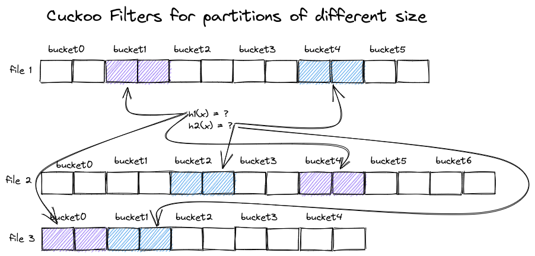
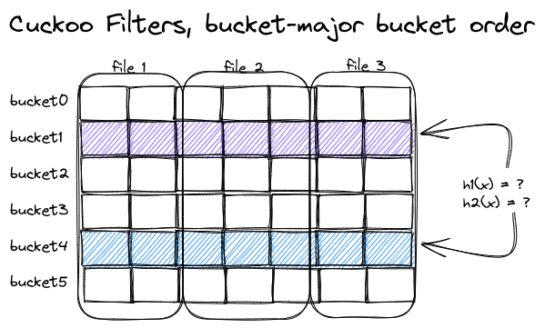
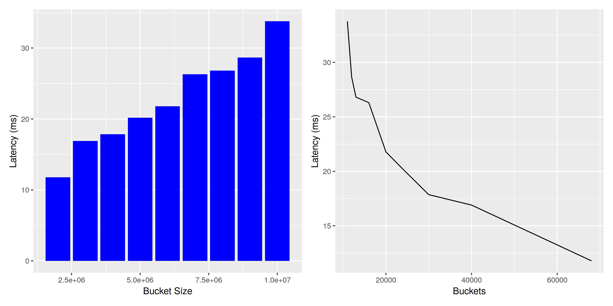
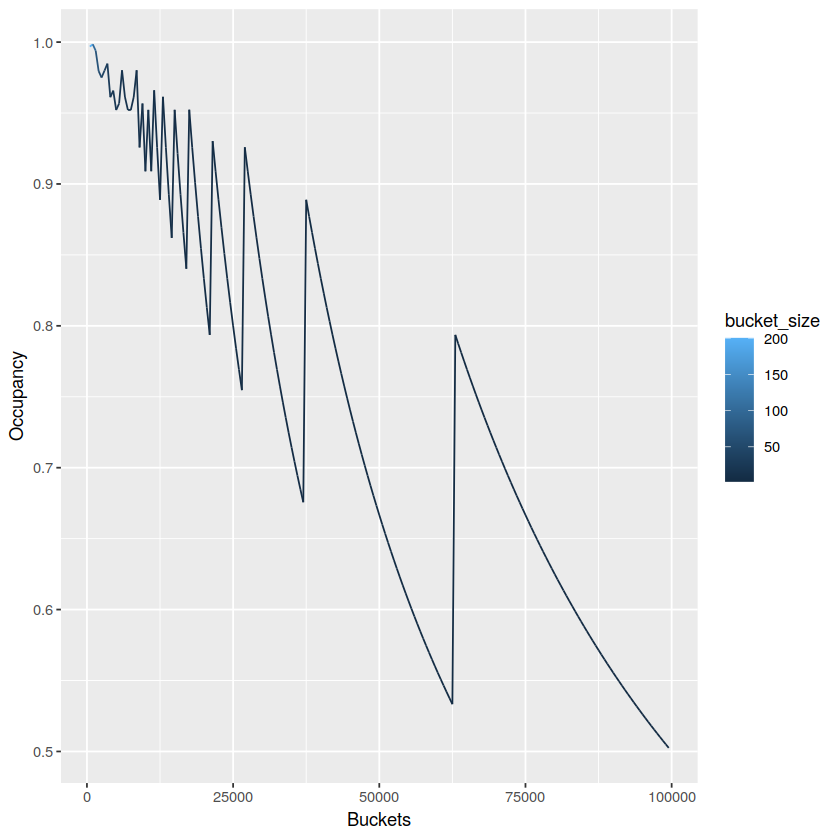
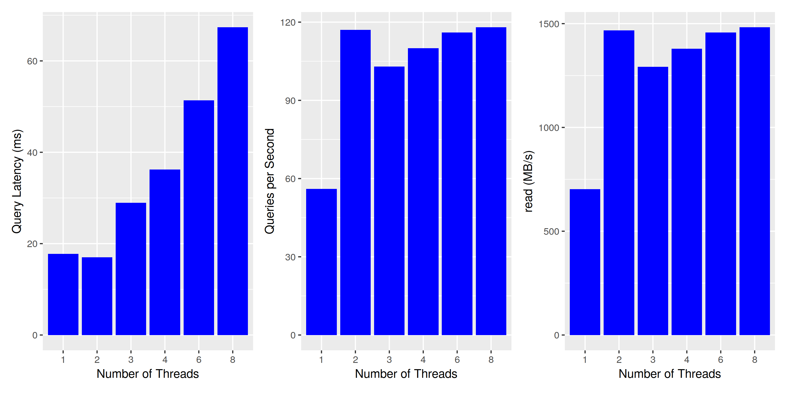
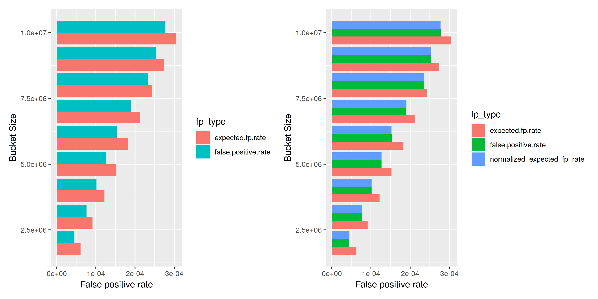

# Efficient Execution of Point Queries in Large Tables

$$ \eps $$

\\[ \sigma \\]

\\( \delta \\)

test

TODO:

- "data lake" is not actually a good term. A data lake is very different things to different people,
  so it would be great if we could come up with a more meaningful name.

## Summary

<!-- state: good -->

In this blog post, we present a fast, efficient way to facilitate point queries
on large parquet-based tables consisting of millions of files. By utilizing
aligned arrays of Cuckoo Filters, we aim to identify files that likely have the
data you're looking for, using only two read operations, while keeping all your
index data on disk.

Depending on the latency of the underlying storage layer, we are able to
identify relevant data files in milliseconds, enabling a query engine to only
consider a small fraction of the original data, speeding up
needle-in-a-haystack queries by orders of magnitudes.

## Motivation

<!-- state: good, minus "data lakes" -->

Data Lakes [TODO] provide efficient storage for large amounts of data
leveraging columnar file formats like [parquet][parquet], and are often
optimized for analytical queries and batch-processing of data.

Due to efficient compression, storing data in a columnar format can also be
attractive for data that does not actually fit the "analytical processing"
paradigm, by reducing storage cost or making it possible to store data that
would otherwise be infeasible. This includes network telemetry, structured
service logs, or similar event-centric data that comes in large quantities.

Unfortunately, this type of data is often queried in ways that would be better
served by a database, backed by an index: How do you find all the logs related
to a specific request ID, or all the hosts in your network that previously
established a connection to a newly identified botnet? In a sea of parquet
files, without additional information, the only option is a full table scan.
There's a variety of mitigations and workarounds, like data partitioning, but
this typically involves optimizing the data layout for one or two specific
types of queries from the get-go, and is not always practical if data is used
for more than one purpose or queried on multiple columns.

[parquet]: https://parquet.apache.org/

## Approximate Membership Query Filters

[Bloom filters][wiki-bloom] and [related datastructures][wiki-amq] are a great
fit for this type of problem: a very compact representation of a set of values
(e.g., all values in a single parquet file), that allows to approximately check
a value to either _maybe_ exist in a set or _definitely not_ exist in the set.

By creating such a filter for every parquet file, it is possible to trim down
the number of files to read by first consulting the filter. Databricks provides
this [feature][databricks-bloom] by maintaining a separate index file per
parquet file, and can skip reading irrelevant files alltogether. A similar
approach is specified as [part][parquet-bloom] of the parquet format, where
bloom index pages are maintained as part of the row group metadata of each
parquet file. However, both approaches are tied to the parquet format. As these
solutions maintain the index data in a one-to-one relationship with the
associated parquet file, they require making one read request for each
candidate file, leading to excessive I/O if the initial set of candidate files
is large.

We can work around the I/O burden by keeping the bloom filters in memory. The
downside here is that the memory requirements for your index grow with the
amount of data you want to store; a single bloom filter for 1 million elements
can grow over 1.7MB even for [a modest false positive rate of
$0.1\%$][hurst-bloom]. With one million files, that's almost 2TB of index data
to keep in memory, which also has to be pre-loaded before a query can even
start executing. Even if there is sufficient memory available, evaluating a
million independent bloom filters translates to millions of single-bit reads on
more or less random memory locations, which is not nearly as fast as you would
come to expect from "in-memory" operations.

[parquet-bloom]: https://github.com/apache/parquet-format/blob/master/BloomFilter.md
[databricks-bloom]: https://docs.databricks.com/optimizations/bloom-filters.html
[wiki-bloom]: https://en.wikipedia.org/wiki/Bloom_filter
[wiki-amq]: https://en.wikipedia.org/wiki/Approximate_Membership_Query_Filter
[hurst-bloom]: https://hur.st/bloomfilter/?n=1000000&p=1.0e-3&m=&k=

## Our Approach (TODO: anything better?)

Can we do better? We want to have the performance of the in-memory bloom
filters, but we don't want to keep the index data in memory; We need a data
structure that allows us to perform approximate membership queries for the same
value(s) on many sets simultaneously, which keeps the index data on disk while
avoiding a separate read operation for each individual set.

### Cuckoo Filters: An Alternative to Bloom Filters

[Cuckoo Filters][cuckoo-wiki] (see [paper][cuckoo-paper]) provide a useful
improvement over bloom filters for our use case, by requiring exactly two read
operations for a single-value lookup - bloom filters require a number of
lookups that depends on the desired false-positive rate (you can play with a
great bloom filter calculator over [here][hurst-bloom]). There's a great
introduction to Cuckoo Filters with some animations on
[brilliant.org][cuckoo-brilliant]. 

We will use a small variation on the original Cuckoo Filter implementation by
allowing to grow the number of slots per bucket, which enables us to encode
sets of different sizes using the same number of buckets, which is useful in
case the parquet files to index are varying in size or number of 
distinct values in the indexed column.

[cuckoo-wiki]: https://en.wikipedia.org/wiki/Cuckoo_filter
[cuckoo-paper]: https://www.cs.cmu.edu/~binfan/papers/conext14_cuckoofilter.pdf
[cuckoo-brilliant]: https://brilliant.org/wiki/cuckoo-filter/

In the example above (TODO: verify image being in the right place, not true
for pdf), we sketched a Cuckoo Filter with six buckets and two slots,
providing a capacity for 12 entries. Each entry stores the fingerprint of a single value,
and each value is mapped to both a fingerprint and two buckets.

A lookup for a value $x$ computes the two candidate buckets and checks all
slots of these two buckets for its fingerprint. A collision (false positive)
occurs when another value has the same fingerprint in one of the two buckets.
The false positive rate $fp$ of the Cuckoo Filter is thus determined by the bucket
size $b$, the number of hash functions $h = 2$ and the size of the fingerprint
in bits, $fb$:

$$ \text{fp} = \frac{2 b}{2^{fb}} $$

In other words, for a fixed number of distinct values in your set, you can
reduce the false positive rate by increasing the size of the fingerprint, or by
increasing the number of buckets to bring the bucket size $b$ down. On the
other hand, a small bucket size $b$ reduces the expected table occupancy.
According to the [paper][cuckoo-paper], bucket sizes of $b = 1, 2, 4, 8$  lead
to expected occupancies of $50\%, 84\%, 95\%$, and $98\%$ respectively.

The hash function that selects our candidate buckets depends on the number of
buckets, which, for a fixed bucket size $b$, depends on the number of elements
in the set.

### Aligning Cuckoo Filters

The previous image shows how evaluating a number of Cuckoo Filters for
partitions of different sizes leads to all the problems we initially described
for the bloom filter approach: we have to search for a given fingerprint in a
bunch of mostly random memory locations - trying this with index data stored on
disk will not perform, and we'll have to compute $h_1$ and $h_2$ for every
filter individually.

To overcome the irregularity of the data layout, we can try to keep the number
of buckets per filter constant, which leads to a much more regular structure:

By requring all individual filters to have the same number of buckets, a few
things happened:

- $h_1(x)$ and $h_2(x)$ point to the same two buckets for all filters
- to make room for the additional elements in the second filter, we increased
  its bucket size
- we give up on some optimality in both occupancy:
  - filter 2 has 18 instead of 12 entries overall
  - filter 3 has 12 instead of 10 entries overall
- false positive rate for filter 2 has increased alongside bucket size

Evaluating the set of filters now only requires a single computation of
$h_1(x)$ and $h_2(x)$ each, and the memory accesses for each selected bucket
are evenly spaced.

However, the index still only evaluates a few entries here and there, either
reading unnecessary data or making lots of independent micro-sized read
requests. To make everything fall into its proper place, we need one last
trick.

### Bucket-Major Data Layout

To reduce the number of read operations and utilize sequential reads, we
change the layout of our data: instead of storing all index data for the first
file, followed by all index data for the second file, we store all index data
for the first bucket, followed by all index data for the second bucket, and so
on. Now, all data for the two buckets that are needed to identify candidate
partitions is in only two memory locations, each containing a long stream of
fingerprints representing the data of a single bucket, but for all
files or partitions:

### Conclusion

We made some progress in this section: we found a representation of the index
data that avoids costly random reads, but does not require the index data to
reside in memory. How does it perform? We'll look at some benchmarks in the
next section.

## Benchmarking

As already mentioned, we implemented our approach as a proof of concept,
available on [github][github-pi]. It currently only supports data stored on a
file system (sadly, no blob storage), and there's no write-ahead log or
recovery strategy.

We store two principal types of data: 

1. Bucket data, which is a sequence of 16-bit fingerprints, maintained in a
   separate file per bucket.
2. Partition metadata, which contains a partition identifier, a `removed` flag
   and, crucially, the bucket size of that partition. The latter is important
   becaues you need to be able to restore which partition a matching fingerprint
   actually belongs to - the information "we have a matching fingerprint in
   position $3192$" is not sufficient.

While the index data remains on disk, the partition metadata resides in-memory,
and clocks in at $25$ bytes per partition for my benchmark implementation. The
actual size depends on how you want your partition to be identified. If you
store the path of a parquet file that obviously requires more space than if you
can get away with a UUID.

Benchmarks have been performed on a Thinkpad P14s with an AMD Ryzen 7 Pro 5850U
CPU and 48GB of memory. All tests used the local NVMe SSD. Note that we only
benchmark the index itself - there's no actual parquet files with real data,
and artifical data is crafted in a way that allows recreating the entire large
dataset from a small set of parameters: the number of partitions $p$, the number
of elements per partition $e$, the number of buckets $b$. This setup allows us
to simulate datasets with up to 100 billion entries, consuming only 250GB from
our precious benchmark hardware.

To test the ability to serve concurrent read requests, each data set is queried
with varying levels of concurrency.

[github-pi]: https://github.com/dispanser/partition-index

### Overall Performance

To get us started, we're simulating a dataset with $100k$ rows per partition.
We configure the index to have $38000$ buckets, and expect that each partition
has a resulting bucket size of $3$. This is not always true: it seems that for
about 10% of the partitions,  partition's bucket size grows to occupy $4$
slots. The overall occupancy was about $0.8$, so we're wasting quite a bit of
space.

Here's the query latency for a single-threaded run with varying number of
partitions:

| Index size | #Partitions | Bucket size | #Buckets | Latency ms|
|-----------|-----------|-----------|-----------|-------|
|$1 \times 10^{10}$	|100000	|327060	  |38000	|0.527|
|$2 \times 10^{10}$	|200000	|654235	  |38000	|2.307|
|$3 \times 10^{10}$	|300000	|981886	  |38000	|4.346|
|$4 \times 10^{10}$	|400000	|1308534	|38000	|6.304|
|$5 \times 10^{10}$	|500000	|1635382	|38000	|9.267|
|$6 \times 10^{10}$	|600000	|1963086	|38000	|9.793|
|$7 \times 10^{10}$	|700000	|2289914	|38000	|10.371|
|$8 \times 10^{10}$	|800000	|2616379	|38000	|13.153|
|$9 \times 10^{10}$	|900000	|2944014	|38000	|15.010|
|$10 \times 10^{10}$	|1000000|	3271554	|38000	|17.758|

For one million partitions, we can retrieve candidate partitions results in
less than $20$ ms. This is an amazing result, given that the index contains 100
billion entries, but keep in mind that the partitions where all equally sized
and the bucket size was configured to perfectly match the partition size,
leading to buckets that are as small as possible. We'll look into the effect of
varying the number of buckets in the next section.

:::note 
The first row with 10 million partitions is surprisingly a lot faster
than the next row: I'm attributing this to the file system cache, which is able
to keep the entire index cached for the first run, but doesn't quite fit the
larger index sizes - and its effect is successively getting smaller the larger
the data set.
:::

Let's look into how varying the number of buckets effects query performance.

### Number of Buckets: The Performance Dial

A query execution for finding all partitions containing a specific value `x`
has to search for the fingerprint in exactly two buckets, where all
buckets are equally long. The bucket size depends on:

1. The number of buckets: if fingerprints are distributed over more buckets,
   each bucket contains less fingerprints.
2. The number of elements in each partition: more data leads to
   longer buckets
3. The number of partitions: each partition just appends its data to all buckets

The work that needs to be done strictly depends on the number of fingerprints
in each bucket, and we expect a mostly linear relationship between query
execution time and bucket size. To verify this assumption, we're running a
benchmark on an index with $100k$ entries per partition, one million partitions,
and a varying number of buckets ranging from 11000 to 68000. The resulting 
buckets contain 10 million to two million fingerprints, respectively.

The linear relationship between bucket size and query latency is clearly
visible in the plot. The number of buckets is inversely proportional to the
bucket size, so the associated plot is a shoddy approximation of $\frac{1}{x}$.

As a consequence, to improve query performance you can increase the number of
buckets, at the expense of a reduced occupancy (see next subsection) and by
making index maintainance more difficult (see next section). It is probably
not useful to increase the number of buckets further when most partitions
already have an individual bucket size of $2$ or $3$, as the disadvantages of
having too many buckets start to outweigh the gains.

- re-run overnight with 100 million entries

### Occupancy

To see the effect of the number of buckets on the occupancy of the index,
we created an index for a single partition with 100k elements, using buckets
from $[100 .. 100k)$ in steps of $500$.

What's happening here is that incrementing the number of buckets makes
occupancy worse until a point where the partition data can fit in one less
bucket, and occupancy jumps up. The occupancy is ideal near the peaks, but it's
not possible to optimize this for all partitions individually, as they all
share the same number of buckets. The ideal bucket size thus depends on how
big your partitions typically are, how much this size varies and how many
partitions of each size you typically expect.

### Concurrent Reads

It doesn't seem promising to execute a single query on multiple CPU cores:
while it's in theory possible to walk over both buckets fingerprints in
parallel, or even split a bucket into smaller chunks, in reality the most
expensive part is probably waiting for the data (this is magnified when running
on cloud storage).

However, it should be easy to concurrently execute multiple queries. In this
section, we're looking into the effects of running $1, 2, 3, 4, 6, 8$ 
concurrent queries against a single index. Since the queries don't get in the
way of each other, we hope to see a linear scaling number of queries
per second when increasing the number of readers.

We use an index with 1 million partitions, $100k$ entries each, and capture
the query execution latency (i.e. a single thread running a single query),
the query throughput (number of queries executed per second), and the read
throughput (MB/s of data processed).

We expect the latency to stay constant (each thread does the same work, after
all), and the throughput to scale linearly with the number of threads.

This does not look good - query latency is not constant when executing multiple
queries at the same time. To understand what's going on, we added two
additional plots to the chart: queries per second and read bytes per second.
Both are just different views into the same data, as each query reads exactly
the same amount of data. However, this tells us that the number of queries is
constant when running on two or more threads, and we might actually reach the
limits of my laptop's disk. While it's specified to 3.5GB/s sequential reads, a
quick test with `hdparm` yields 2.2GB/s - maybe this meager 1.5GB/s is all it
can deliver when reading files of size 6MBs? To test our assumption, we re-run
the same experiment with a reduced number of buckets, thereby increasing the
bucket size. We're also running an experiment with a much smaller index size -
reducing the number of partitions to $50k$, thereby enabling it to serve all
data from the file system cache.

- run again with 11k
- run with a smaller set (50k partitions, maybe?)
  - to estimate in-memory / file cached experience

### False Positive Rate

<!-- state: good -->

To make sure our index works as expected, we check that there are no false
negatives (i.e. a query always produces the partition(s) owning the value) and
also take a look at the false positive rate. As discussed previously, for a
single cuckoo filter it's $\text{fp} = \frac{2 b}{2^{fb}}$, where $b$ is the.
bucket size, and $fb$ is the number of bits of the fingerprints.

I was initially surprised by the fact that the actual false positive rate was
_below_ the theoretical one, but later realized that the formula ignores vacant
slots. On the right side, we're normaling the expected false positive rate and
multiply by the occupancy, which gives an almost perfect match between the
experimentally tested and the theoretically expected false positive rate.

With an _optimal_ bucket layout, we achieve a fp rate of $1$ in $20000$, which
grows with a decreasing number of buckets. If we chose to represent
fingerprints w/ 24 bits, we'd be looking at a very healthy false positive rate
below one in a million, in exchange for an additional 50% of data in each
bucket. However, the current implementation is kept simple and hard-codes the
fingerprint width to $16$ bits.

## On Appending Data

So far, we store our data as one long, consecutive stream of bytes, writing
data for successive buckets back to back. This layout makes it impossible to
append additional files to the index structure, as there is simply no space
between buckets to accomodate for the newly added fingerprints.

But this is not really necessary: buckets are always read independently, so it
makes perfect sense to store the data for individual buckets in separate blobs
or files. With that change in layout, appending data for a newly created
partition requires appending the data for each bucket to its associated blob.

This is not a cheap operation; we're appending a few fingerprints to thousands
of different places. The behavior is somewhat expected: we optimized the data
layout to serve queries with the minimum possible number of reads, and data is
written predominatly by an orthogonal dimension (buckets vs partitions).

We don't have a good solution for that problem: In our prototype, multiple
writes are buffered to amortize writing bucket data. If the indexed data
consists of immutable events, and the workload is read-heavy it may be worth
maintaining an expensive index structure, which is a very similar trade-off to
maintaining an index or a materialized view in any database system.

Buffering data also introduces all the pitfalls and complexities we all
~~loathe~~ love from distributed systems: when buffering writes in memory, we
probably need some sort of write-ahead log of new index data, likely in the
form of appending the original cuckoo filter data as a per-partition blob, and
a way to restore that WAL on crash recovery.

## Conclusion

## Resterampe

- adding data is hard
	- split off the data representation into one file or blob per bucket
	- new picture, accordingly

### Partitioning 

By grouping data into a directory tree, where the nested path structure is
organized according to some columns of the data, you can reduce the search
space by only having to consider some parts of the directory tree. This
strategy is called [partitioning][partitioning], and works great in case
a query search condition matches the primary partitioning column. However,
it has limitations:

1. Adding too many partition columns yields very small partitions, losing the
	 benefit of the columnar representation. You have to make a choice on the
	 most helpful partitioning colums beforehand, and it's not realistic to serve
	 more than two, maybe three different types of queries. Changing the partitioning
	 columns later may require a complete rewrite of all your data.

2. Partitions should yield approximately similar-sized partitions, otherwise
   you may end up with [skewed data][dataskew].

3. Your ingestion scheme may already dictate your top-level partition column:
   when you're ingestion network telemetry data near real-time, it may not be
	 possible to partition it into the source ip address, because that would mean
	 you'd be frequently appending small amounts of data to all partitions, creating
	 loads of small files. In my experience, event-based data is commonly ingested
	 with some date- or time-related partitioning column, which makes sense for
	 ingestion, supports time-ranged queries well and eases data governance tasks
	 (e.g., GDPR-related removal of data after a certain time).

[partitioning]: https://medium.com/nerd-for-tech/hive-data-organization-partitioning-clustering-3e14ef6ab121
[dataskew]: https://selectfrom.dev/data-skew-in-apache-spark-f5eb194a7e2

### Parquet File and Row Group Column Statistics

[Parquet][parquet] does not only store your raw data, but also includes _column
statistics_ in its [footer][footer] to further reduce the amount of data that
needs to be scanned. The data includes min / max values for each column, both
for the entire file as well as each row group. If your query contains an
expression that is out of the min/max range, the entire file or select row group
can immediately be discarded. This typically works well if data in your parquet
is sorted along the relevant column, but it always incurs the initial effort to
read and parse the file metadata. If your query can not leverage your
partitioning scheme, you'll still need to access all files.

[footer]: http://cloudsqale.com/2021/01/15/parquet-1-x-file-format-footer-content/

## Performance Analysis: Theory

- size to read: 2x(sum over all partitions p: slots(p)) * 2 (bytes)
- 2 I/O operations
- false positive rate: give for a single partition
  - note that large partitions have more slots, so they have higher fp-rate
	- number of buckets: more is better, up to a point (-> fill rate)
- 

## Data: Benchmarks

describe dataset

- generate partitions: don't actually store partitions, just data to reconstruct them 
	- we only benchmark the index, not actually reading data
- things to play with:
	- number of partitions
	- number of distinct values per partition
	- number of buckets
	- number of threads for concurrent read
tracked valus
- (tbd!) fill rate
- (tbd!) fp rate
- throughput: queries per second
- throughput: MB / s
- avg latency per query + std dev
- median latency per query + MAD

## Random thoughts for later

- merge and append
- use for other types of data: indexing text documents / source code / ...
- "partition" can be a parquet file
	- a row group in a parquet file
	- a server that has your data
	- a directory with a bunch of csv files
	- ... any other good option?
	

### Random stuff [tbd]

> Create a short paragraph explaining the advantages of columnar data storage

> Columnar data storage has several advantages over traditional row-based storage. First, it allows for efficient compression of data, as each column can be compressed separately based on its data type and distribution, resulting in smaller storage requirements and faster data retrieval. Second, columnar storage allows for better query performance, as it only reads the columns that are required for a given query, reducing I/O operations and improving response times. Third, columnar storage facilitates parallel processing, as different columns can be processed independently, enabling faster data processing and analysis. Finally, columnar storage is more flexible and scalable, as new columns can be added without affecting the existing data structure, making it easier to accommodate changes in data requirements over time.
